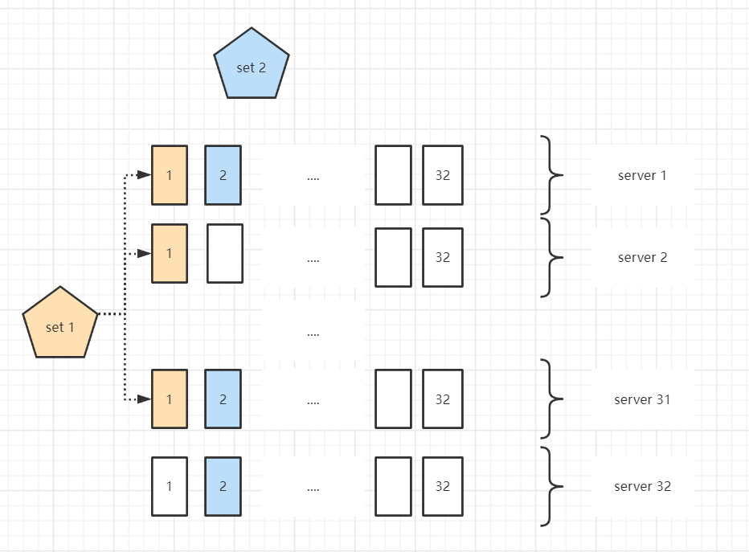
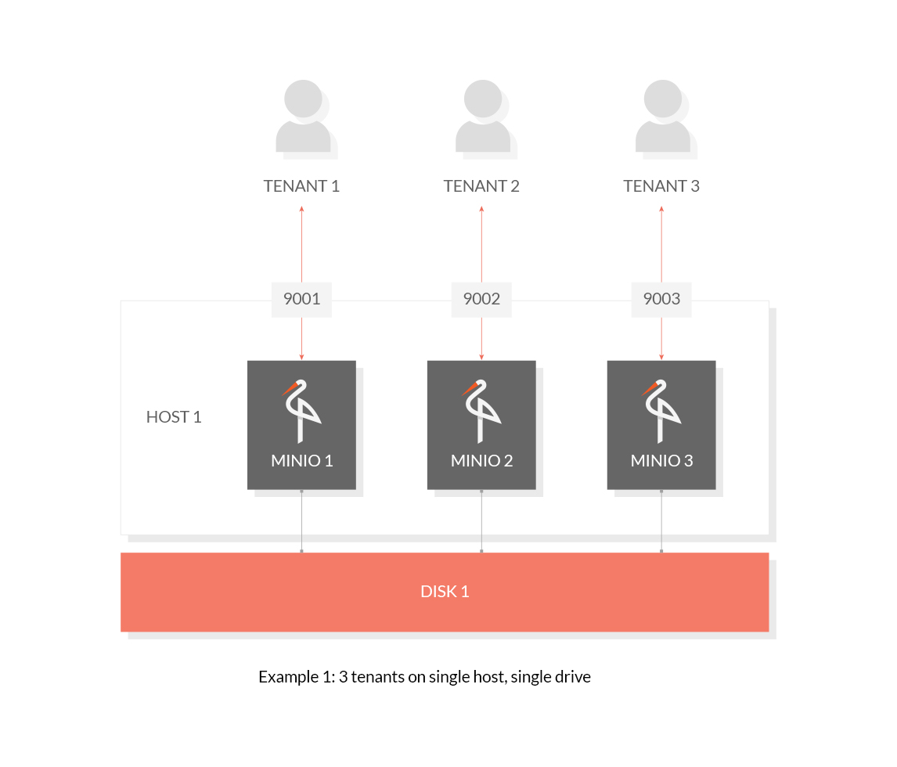
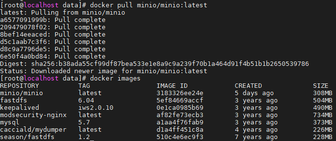
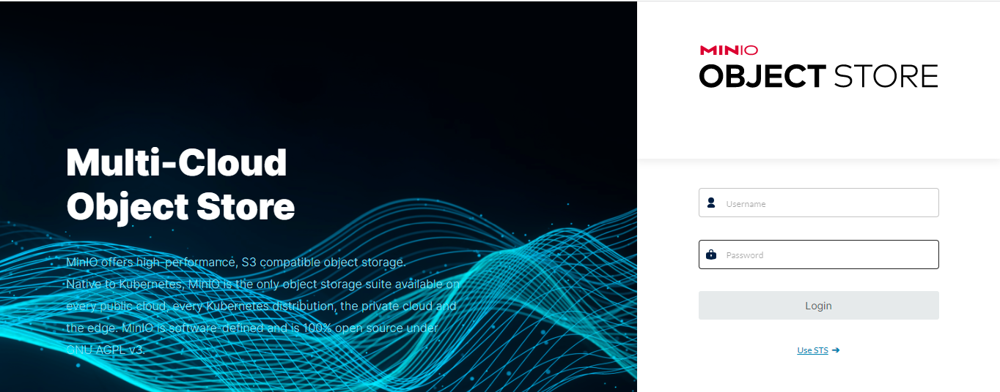
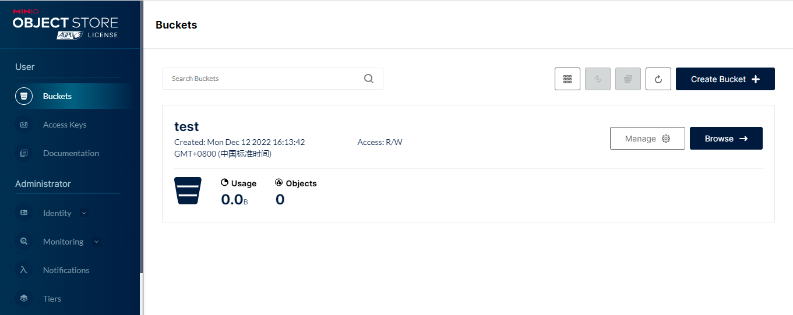
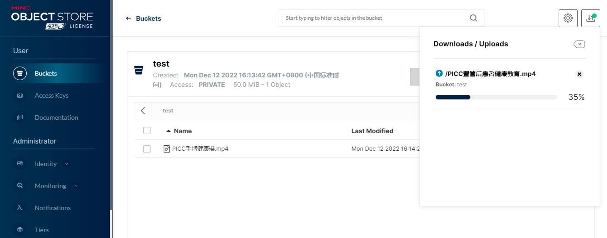
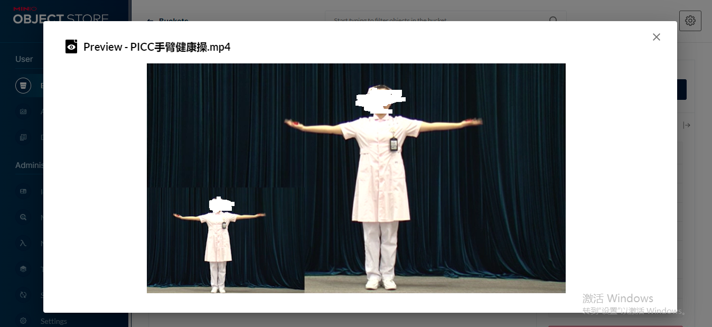
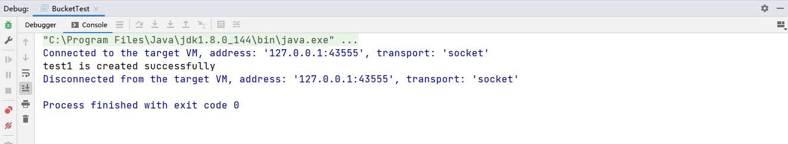
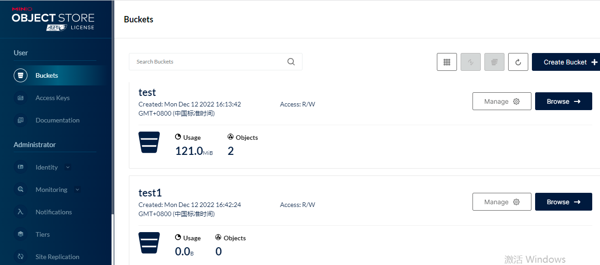

# MinIO入门

## MinIO是什么

MinIO 是一个基于Apache License v2.0开源协议的对象存储服务（Object Storage Service，OSS），虽然轻量，却拥有着不错的性能。它兼容亚马逊S3云存储服务接口，非常适合于存储大容量非结构化的数据。 例如图片、视频、日志文件、备份数据和容器/虚拟机镜像等，而一个对象文件可以是任意大小，从几 kb 到最大 5T 不等。

## MinIO的特点

1. 高性能：MinIO号称是世界上速度最快的对象存储服务器 

   > MinIO is the worlds fastest object store with published GETs/PUTs results that exceed 325 GiB/sec and 165 GiB/sec on 32 nodes of NVMe drives and a 100Gbe network. 

2. 可扩展性：通过联盟模式可以实现 MinIO 从单个群集到其他 MinIO 群集联合使用的情况，并且在需要时可以跨越多个不同的数据中心。

3. 云原生：能与Kubernetes、Docker Swarm编排系统良好对接，实现灵活部署

4. 丰富的SDK支持: 提供了JavaScript、java、Python、Golang、.Net 等多种语言的客户端开发SDK

5. 数据安全性高：支持纠删码数据恢复，可以在一定数量磁盘损坏下恢复数据，详情请见[MinIO纠删码](server/minio/MinIO纠删码.md)。支持比特位保护，使用高度优化的HightwayHash算法保证从不读到错误的数据

6. 源代码100%开放，企业级支持，官方文档齐全

## MinIO的官方资料

1. [英文官网](https://min.io/)
2. [中文官网(更新延迟)](https://www.minio.org.cn/)
3. [Java Client API Reference](https://min.io/docs/minio/linux/developers/java/API.html)
4. [GitHub仓库地址](https://github.com/minio/minio)
5. [GitHub java apis and examples](https://github.com/minio/minio-java)

## MinIO的基本概念
1. Object：存储到 MinIO 的对象，如文件、字节流，Anything...

2. Bucket：用来存储 Object 的逻辑空间。每个 Bucket 之间的数据是相互隔离的。对于客户端而言，就相当于一个存放文件的顶层文件夹。

3. Drive：即存储数据的磁盘，在 MinIO 启动时，以参数的方式传入。MinIO 中所有的对象数据都会存储在 Drive 里。

4. Set ：即一组 Drive 的集合，分布式部署根据集群规模自动划分一个或多个 Set ，每个 Set 中的 Drive的数量是固定的，由系统根据集群规模自动计算得出，每个Set的Driver 尽可能分布在不同位置，一个对象存储在一个 Set 上。

   

## MinIO如何写入对象

MinIO将一个对象进行数据编码成 N 份（N 就是一个 Set 上面 Drive 的数量，后面多次提到的 N 都是指这个意思），然后把每一份编码写到对应的 Drive 上面，这就是前面提到的把一个对象存储在一个 Set 上。

一个集群包含多个 Set，每个对象最终存储在哪个 Set 上是根据对象的名称进行哈希，然后映射到唯一的 Set 上面，这个方式从理论上保证数据可以均匀的分布到所有的 Set 上

## MinIO快速入门

用docker快速搭建一个单机单磁盘模式的MinIO服务



该模式下，MinIO只在一台服务器上搭建服务，且数据都存在单块磁盘上，该模式存在单点风险，主要用作开发、测试等使用

### 拉取镜像

- 打开网站 [docker hub](https://hub.docker.com/)
- 搜索关键字 minio/minio
- 拉取最新镜像 docker pull minio/minio:latest



 ### 创建目录

```markdown
mkdir -p /data/minio/config
mkdir -p /data/minio/data
```

/data/minio/config存放配置，/data/minio/data存储上传文件的目录

### 创建容器

```dockerfile
docker run -p 9000:9000 -p 9090:9090 \
     --name minio \
     -d --restart=always \
     -e "MINIO_ROOT_USER=admin" \
     -e "MINIO_ROOT_PASSWORD=admin123" \
     -v /data/minio/data:/data \
     -v /data/minio/config:/root/.minio \
     minio/minio server \
     /data --console-address ":9090" -address ":9000"
```

上述命令中设置了如下参数：

* MINIO_ROOT_USER Web网页访问管理员账号
* MINIO_ROOT_PASSWORD Web网页访问管理员秘钥
* /data/minio/data:/data 挂载持久化数据目录
* /data/minio/config:/root/.minio 挂载配置文件
* server 启动 Server 模式，除了该模式还有一个 Gateway 模式。
* /data 指定数据目录
* 9000为API和客户端连接端口，9090为Web网页访问端口

### 客户端使用入门

- 访问MinIO Console，地址为：http://ip:9090

  

  MinIO Console是MinIO自带的可视化管理工具,新版的功能还是很强大的。不仅支持了存储桶、文件的管理，还增加了用户、权限、日志等管理功能。

- 创建bucket

- 

- 上传Object

  

- 预览Object

  

### Java SDK使用入门

创建一个普通maven工程，测试创建bucket，参考[官方示例](https://min.io/docs/minio/linux/developers/java/minio-java.html)

- maven依赖， 去[maven仓库](https://search.maven.org/)搜索

```xml
<dependency>
    <groupId>io.minio</groupId>
    <artifactId>minio</artifactId>
    <version>8.4.6</version>
</dependency>
```

- 测试代码

```java
public static void main(String[] args) {
    try{
        MinioClient minioClient =
                MinioClient.builder()
                        .endpoint("http://192.168.142.188:9000")
                        .credentials("minioadmin", "minioadmin")
                        .build();

        if (!minioClient.bucketExists(BucketExistsArgs.builder().bucket("test1").build())) {
            minioClient.makeBucket(MakeBucketArgs.builder().bucket("test1").build());
            System.out.println("test1 is created successfully");
        }
    }catch (Exception ex){
        ex.printStackTrace();
    }
}
```

- 代码运行结果：



- 查看console后台

