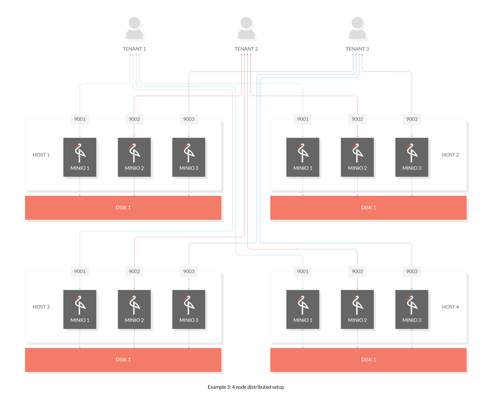

# MinIO分布式集群部署

## 简介

MinIO针对不同应用场景提供了不同的存储架构，前面我们介绍了两种存储架构，一个单机单磁盘存储，一个单机多磁盘存储架构。现在我们来介绍一种分布式存储架构。



该模式是MinIO服务最常用的架构，通过共享一个access_key和secret_key，在多台（2-32）服务器上搭建服务，且数据分散在多块（大于4块，无上限）磁盘上，提供了较为强大的数据冗余机制，保证了数据的安全性、一致性，服务的可靠性。

## MinIO分布式的特点

### 安全性

1. 采用纠删码来防范多个磁盘损坏
2. 采用比特位保护数据的正确性

### 一致性

MinIO在分布式和单机模式下，所有读写操作都严格遵守**read-after-write**一致性模型。

### 可靠性

单机MinIO服务存在单点故障，相反，如果是一个有N块硬盘的分布式MinIO, 只要有N/2硬盘在线，你的数据就是安全的。

> 不过你需要至少有N/2+1个硬盘来创建新的对象。例如，一个16节点的MinIO集群，每个节点16块硬盘，就算8台服务器宕机，这个集群仍然是可读的，不过你需要9台服务器才能写数据。

## MinIO分布式实战

准备两台服务器 10.52.176.4   10.52.176.6

### 二进制部署


### docker 部署

注意docker部署集群模式时必须指定-–net=host参数，使用主机网络，采用端口映射无法创建集群

在服务器 10.52.176.4 、10.52.176.6 分别执行以下脚本

```powershell
docker run -d --name minio-s \
  --restart=always \
  --net=host \
  -e MINIO_ROOT_USER=admin \
  -e MINIO_ROOT_PASSWORD=admin123 \
  -v /home/minio/data1:/data1 \
  -v /home/minio/data2:/data2 \
  minio/minio server \
  --address ':9910' \  		 # 非必需，除非想修改默认9000端口
  --console-address ':9922' \ # 非必需，除非想指定端口
  http://10.52.176.4:9910/data{1...2} \
  http://10.52.176.6:9910/data{1...2} 
```

注：开发与测试，可以在单机开多个端口模拟集群部署

### docker-compose 部署

在用docker-compose部署集群之前，我们先看看docker-compose单机部署的脚本，如下

```powershell
version: '3'
services:
  minio:
    image: minio/minio
    hostname: "minio-single"
    ports:
      - 1000:9000 # api 端口
      - 1090:9090 # 控制台端口
    environment:
      MINIO_ROOT_USER: admin    #管理后台用户名
      MINIO_ROOT_PASSWORD: admin123 #管理后台密码，最小8个字符
    volumes:
      - /home/minio/data:/data               #映射当前目录下的data目录至容器内/data目录
      - /home/minio/config:/root/.minio/     #映射配置目录
    command: server --console-address ':9090' /data  #指定容器中的目录 /data
    privileged: true
    restart: always
```

docker-compose部署集群（官方推荐），docker-compose.yaml

```powershell
version: '3.7'

# 所有容器通用的设置和配置
x-minio-common: &minio-common
  image: minio/minio
  command: server --console-address ":9001" http://minio{1...4}/data
  expose:
    - "9000"
  # environment:
    # MINIO_ROOT_USER: minioadmin
    # MINIO_ROOT_PASSWORD: minioadmin
  healthcheck:
    test: ["CMD", "curl", "-f", "http://localhost:9000/minio/health/live"]
    interval: 30s
    timeout: 20s
    retries: 3

# 启动4个docker容器运行minio服务器实例
# 使用nginx反向代理9000端口，负载均衡, 你可以通过9001、9002、9003、9004端口访问它们的web console
services:
  minio1:
    <<: *minio-common
    hostname: minio1
    ports:
      - "9001:9001"
    volumes:
      - ./home/minio/data1:/data

  minio2:
    <<: *minio-common
    hostname: minio2
    ports:
      - "9002:9001"
    volumes:
      - ./home/minio/data2:/data

  nginx:
    image: modsecurity-nginx 
    hostname: nginx-minio
    volumes:
      - ./home/minio/config/nginx.conf:/etc/nginx/nginx.conf:ro
    ports:
      - "9000:9000"
    depends_on:
      - minio1
      - minio2
```

### nginx-balance 负载均衡

```
user  nginx;
worker_processes  auto;

error_log  /var/log/nginx/error.log warn;
pid        /var/run/nginx.pid;

events {
    worker_connections  4096;
}

http {
    include       /etc/nginx/mime.types;
    default_type  application/octet-stream;

    log_format  main  '$remote_addr - $remote_user [$time_local] "$request" '
                      '$status $body_bytes_sent "$http_referer" '
                      '"$http_user_agent" "$http_x_forwarded_for"';

    access_log  /var/log/nginx/access.log  main;
    sendfile        on;
    keepalive_timeout  65;

    # include /etc/nginx/conf.d/*.conf;

    upstream minio {
        server minio1:9000;
        server minio2:9000;
        server minio3:9000;
        server minio4:9000;
    }

    server {
        listen       9000;
        listen  [::]:9000;
        server_name  localhost;

        # To allow special characters in headers
        ignore_invalid_headers off;
        # Allow any size file to be uploaded.
        # Set to a value such as 1000m; to restrict file size to a specific value
        client_max_body_size 0;
        # To disable buffering
        proxy_buffering off;

        location / {
            proxy_set_header Host $http_host;
            proxy_set_header X-Real-IP $remote_addr;
            proxy_set_header X-Forwarded-For $proxy_add_x_forwarded_for;
            proxy_set_header X-Forwarded-Proto $scheme;

            proxy_connect_timeout 300;
            # Default is HTTP/1, keepalive is only enabled in HTTP/1.1
            proxy_http_version 1.1;
            proxy_set_header Connection "";
            chunked_transfer_encoding off;

            proxy_pass http://minio;
        }
    }
}
```

### 集群扩容

