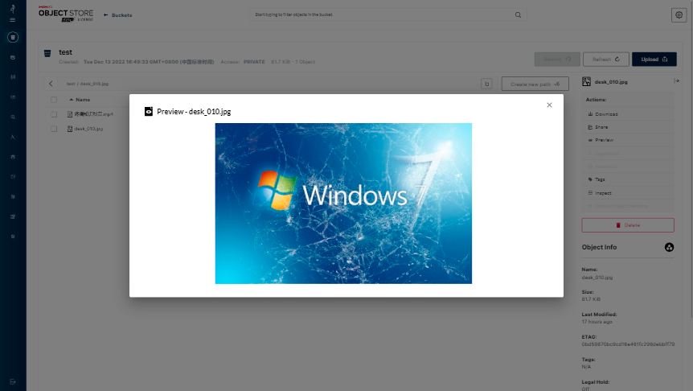

# MinIO纠删码

## 什么是纠删码

纠删码是一种恢复丢失和损坏数据的数学算法， Minio采用Reed-Solomon code将对象拆分成N/2数据和N/2 奇偶校验块。 这就意味着如果一个Set是12块盘，一个对象会被分成6个数据块、6个奇偶校验块，你可以丢失任意6块盘（不管其是存放的数据块还是奇偶校验块），你仍可以从剩下的盘中的数据进行恢复。


如上图，如我们所知，一个对象存储在一个Set上面，这个Set包含16个Drive，其中灰色的一半是数据块，橙色的一半是校验块，这种方式最多能忍受一半的编码丢失或损坏

## 怎么启用纠删码

当MinIO Server实例传入多个本地磁盘参数，MinIO Server会自动启用纠删码。纠删码对磁盘的个数是有要求的，如不满足要求，实例启动将失败（单机模式下至少为4个）。

## 纠删码实战

用docker搭建单机多磁盘的架构服务演示MinIO纠删码是如何保证数据的完整性与安全性


该模式下，MinIO在一台服务器上搭建服务，但数据分散在多块（大于4块）磁盘上，提供了数据上的安全保障

### 创建服务

用文件夹替代磁盘，用伪磁盘模拟测试

```dockerfile
docker run -p 9000:9000 -p 9090:9090 \
     --name minio \
     -d --restart=always \
     -e "MINIO_ROOT_USER=admin" \
     -e "MINIO_ROOT_PASSWORD=admin123" \
     -v /data/minio/data1:/data1 \
     -v /data/minio/data2:/data2 \
     -v /data/minio/data3:/data3 \
     -v /data/minio/data4:/data4 \
     -v /data/minio/config:/root/.minio \
     minio/minio server \
     /data1 /data2 /data3 /data4 \
     --console-address ":9090" -address ":9000"
```


### 测试服务

访问MinIO Console并上传一张图片


查看4个磁盘文件存储结构

说明：以 Bucket 名称为目录，文件名称为下一级目录，文件名下是 part.1 和 xl.meta，前者是编码数据块及检验块，后者是元数据文件


随机删除两个磁盘的数据data1、data2


预览图片依然正常！！！被删除的磁盘数据会自动恢复。



任意删除三个磁盘的数据


打开后台，This location is empty, please try uploading a new file

