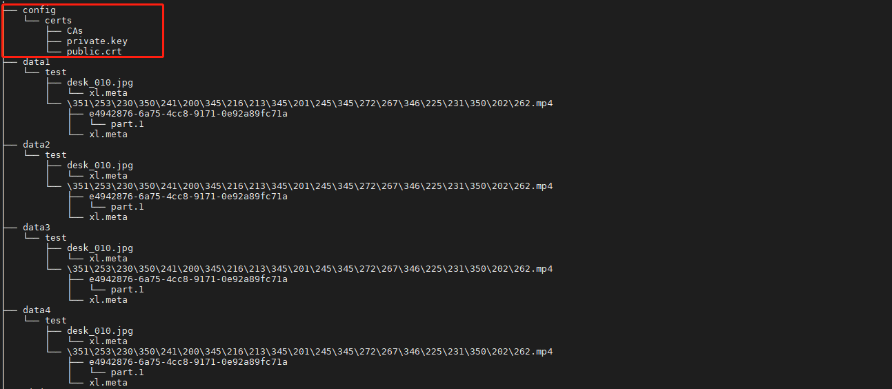
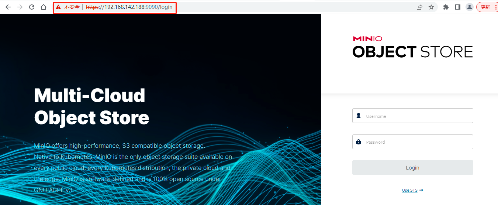
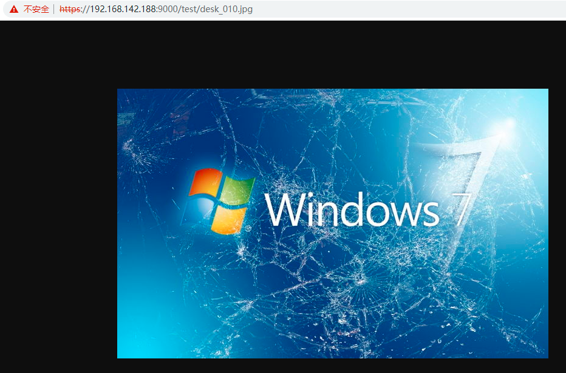

# MinIO配置TLS访问
> 本章节我们将介绍如何在 Linux上配置 MinIO 服务使用 TLS（传输层安全性协议，Transport Layer Security）

## 生成证书

这里我们将采用 OpenSSL 来生成证书，linux安装OpenSSL请参见[OpenSSL官网](https://www.openssl.org/)，生成命令如下：

生成私钥：

openssl genrsa -out private.key 2048

生成公钥：

openssl req -new -x509 -days 3650 -key private.key -out public.crt -subj "/C=CN/ST=changsha/L=hunan/O=yunyucloud/CN=yunyucloud.com"

## 证书配置

如果你已经有私钥（private）和公钥（public）证书，你需要将它们拷贝到 MinIO 的 .minio/certs 文件夹，分别取名为 private.key 和 public.crt，拷贝到服务配置目录：/data/minio/config/certs



## 重启服务

```
docker restart minio
```

##　测试访问

在浏览器输入 https://192.168.142.188:9090



访问对象，https://192.168.142.188:9000/test/desk_010.jpg  



至此，配置TLS访问成功！